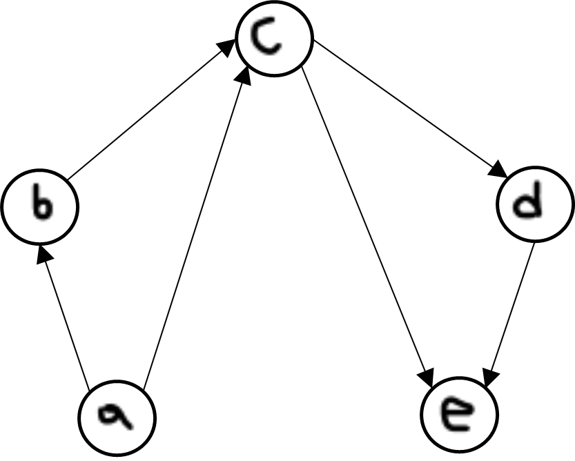

## 8. RELATIONER OCH FUNKTIONER
#
**Definition 8.2:** ***Reflexivitet*** Om relationen $R$ har egenskapen 

$∀xRx$  

kallas relationen **reflexiv** (eng. reflexive).

Överfört till normalt språk betyder definitionen att alla element r relaterade till sig själva. Exempel på reflexiva relationer är *släkt-med*, *lika-gammal-som*, *parallell-med* och *delare-i*. Exempel på relationer som inte är reflexiva är *yngre-än*, *son-till*, *vinkelrät-mot* och *större-än*.

Om relationen är reflexiv finns det i grafen en ögla på varenda nod, och matrisen har ettor utmed hela huvuddiagonalen.
#
**Definition 8.3:** ***Symmetri*** Om relationen $R$ har egenskapen

$∀x∀y(xRy→yRx)$

säges relationen vara **symmetrisk** (eng. symmetric relation).

Det innebär helt enkelt att relationen alltid är ömsesidig. *Syskon-till*, *går-i-samma-klass-som*, *parallell-med* och *ej-lika-med* är exempel på symmetriska relationer. *Far-till*, *kortare-än*, *äkta-delmängd-i* och *större-än* är det inte.

Om relationen är symmetrisk är alla förbindelser i grafen dubbelriktade, och relationsmatrisen är symmetrisk (det vill säga det står samma saker i position $(i, j)$ som i position $(j, i)$).
#
**Definition 8.4:** ***Anti-symmetri*** Om relationen $R$ har egenskapen

$∀x∀y(xRy∧yRx→x=y)$

säges relationen vara **anti-symmetrisk** (eng. antisymmetric relation). 

Den har givna definitionen är den man brukar ge, men följande logiskt ekvivalenta uttryck ar kanske lättare att förstå:

$∀x∀y(¬(xRy ∧yRx)∨x=y)$

Översatt till svenska betyder den andra versionen av definitionen "relationen är aldrig ömsesidig, utom möjligen om de relaterade objekten är identiska".  

Den första versionen kan utläsas "om relationen är ömsesidig sa ar enda förklaringen att objekten är identiska". Det hr är faktiskt något vi redan använt ett antal gånger här i boken (vilka kommer du att fa ta reda på i övning 8.20).

Relationerna *chefar-över* och *son-till* är anti-symmetriska. (I *son-till-fallet* kan vi ju konstatera att man kan säga "relationen är aldrig ömsesidig och därmed punkt", utan att behöva använda undantagsklausulen "utom möjligen om objekten är identiska". Men undantagsklausulen gör ingen skada där den star, även om den i detta fall är onödig.) Relationerna *delmängd-i* och *större-in* är också anti-symmetriska.

Däremot är *bror-till*, *går-i-samma-klass-som*, *parallell-med* och *inte-lika-med* inte anti-symmetriska.

I en graf för en anti-symmetrisk relation finns det inte några dubbelriktade förbindelser (om vi inte räknar öglor som sådana). Har matrisen en etta i position $(i, j)$ så har den garanterat en nolla på andra sidan huvuddiagonalen, i position $(j, i)$. (Regeln gäller dock inte för eventuella ettor på huvuddiagonalen, där $i = j$. Det kan ju inte gärna stå både en etta och en nolla i den positionen!)
#
**Definition 8.5:** ***Transitivitet*** Om följande gäller for relationen $R$

$∀x∀y(x R y∧y R z→ x R z)$

så säges relationen vara *transitiv* (eng. transitive relation). (Jämför begrep. pet "transitera" som betyder att transportera något från ett land till ett annat via ett tredje.)

Detta innebär att om två objekt är indirekt relaterade (via ett annat objekt) sa är de också direkt relaterade. Det är den egenskapen hos *lika-med*. relationen man utnyttjar då man skriver saker som

$2 + 3 * 4 = 2 + 12 = 14$ 
som egentligen är två likheter: $2 + 3 * 4 = 2 + 12$ och $2 + 12 = 14$, ur vilka vi
kan dra slutsatsen att $2 + 3 * 4 = 14$.

Andra exempel på transitiva relationer är *ättling-till*, *yngre-än*, *delare-i* och *parallell-med*. *Son-till*, *kär-i*, *inte-lika-med* och *vinkelrät-mot* är det inte.

Om en relation är transitiv kommer alla objekt som är förbundna med varandra via något annat objekt också vara direkt förbundna. (Det brukar dock vara ganska besvärligt att verifiera detta ur en graf, da det oftast finns väldigt manga förbindelser att kontrollera.)

 

 

Den här avbildade relationen är exempelvis inte transitiv, då det går att komma från b till d via c, medan det inte finns någon direktförbindelse. (Att alla andra tvåstegsförbindelser motsvaras av en enstegsförbindelse hjälper inte - om det inte finns direktförbindelser i samtliga fall är relationen inte transitiv.)

För att avgöra om en relation är transitiv med hjälp av dess matris måste man ta fram matrisen for tvåstegsförbindelserna, det vill säga matrisen för $R∘R$, och kontrollera att det på alla ställen där den har en etta ocksa stär en etta i matrisen för $R$. (Det gör inget om $Μ_R$ dessutom har ettor på ett antal extra ställen.)
